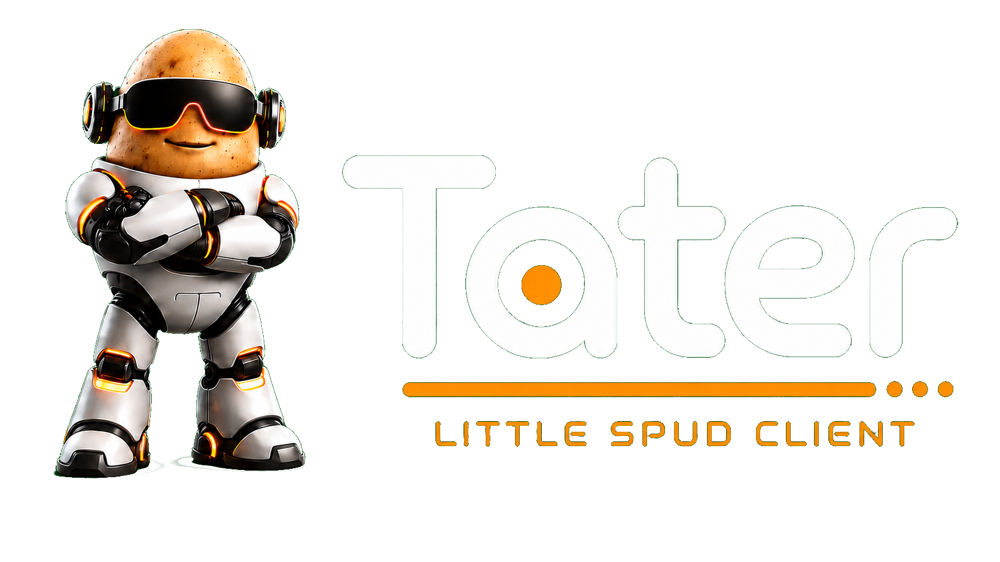

<div align="center">
  <a href="https://taterassistant.com">
    
  </a>
</div>
<h3 align="center">
  <a href="https://taterassistant.com">taterassistant.com</a>
</h3>

# Little Spud WebUI

Little Spud WebUI is a lightweight browser client for Tater Spud Link. It pairs to a Spud Hub or Spudlet with a QR code or manual sync code, then talks to Tater through the native Spud Link API.

Little Spud sends a user name and device name with each chat so Tater can track history as `little_spud:{user}:{device}`. The Hub handles Hydra, tools, generated media, TTS, STT, follow-up mic decisions, and the linked-device token.

## Run locally

```bash
cd /Users/ahphooey/Scripts/Little_Spud_WebUI
python3 -m http.server 4181
```

Open <http://localhost:4181>.

Camera QR scanning requires a secure browser context. `localhost` works for testing; phone/tablet installs should be hosted over HTTPS or from a trusted local app shell.

## Pairing

1. In Tater, open Settings -> Spud Hub.
2. Set the Tater role to Spud Hub or Spudlet.
3. Enable pairing and Little Spuds.
4. Create a pairing code.
5. In Little Spud, enter a user name, confirm the device name, then scan the QR or paste the sync code/payload.

The app stores only the Hub URL, node token, user name, device name, local chat transcript, and display preferences in browser `localStorage`.

## Chat And Media

Little Spud receives native Tater chat events from the Hub, including typing state, tool-call notices, final replies, generated images/files, and follow-up mic decisions. Images, videos, audio, and files can be attached from the browser and sent as native Spud Link message attachments.

The speaker button enables Hub-powered TTS for assistant replies. The mic button streams browser audio to the Hub for server-side STT and auto-sends the transcript when speech ends.

The Notify button enables browser device notifications for queued Little Spud notifications. Browsers require user permission, and delivery depends on the browser staying active enough to poll the paired Tater Hub.

## Spud Hub Requirements

The paired Tater install must be running with Spud Link enabled in Settings -> Spud Hub. Little Spud can connect to either:

- Spud Hub: a full Tater node that owns the model, tools, people API, memory, TTS/STT, and device list.
- Spudlet: a full Tater node linked to a Spud Hub. Little Spuds still receive the same Hub-backed Hydra/tool behavior.

## Notes

If Little Spud is hosted over HTTPS, the Tater URL should also be HTTPS. Use HTTP only when both the Little Spud page and Tater are on HTTP, such as local LAN testing.

For remote access, place both Little Spud and Tater behind HTTPS-capable reverse proxy routes, then use the public Tater URL in the Spud Hub pairing payload.
